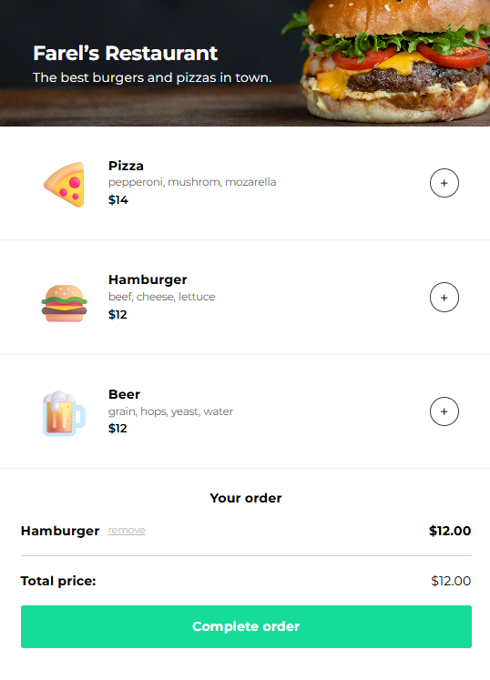

# Restaurant Ordering App

A simple front-end application for ordering food (menu, cart, checkout modal). Built as a DOM + JavaScript modular exercise (ES modules). Suitable for running locally to learn event handling, dynamic HTML rendering, and modal animation.

## 📷 Screenshot

## 📌 Features
- Display menu list (emoji, name, ingredients, price)
- “+” button to add items to order (using data-attribute to link button with item)
- Order section dynamically rendered directly below menu
- Manage item quantity and remove items from order
- `Complete order` button opens modal for payment details input
- After submitting payment: the modal closes, and the order is replaced with a thank you message containing the customer's name
- Smooth animation for opening/closing the modal and fading in the thank you message

## 🛠️ Technology
- **HTML5** – Structure  
- **CSS3** – Styling & Layout  
- **JavaScript** (ES Module)  
- Developed to run with a local web server (not file://) due to the use of type="module"

## 🚀 How it works (quick)
- Menu is generated by `getMenuHtml(menuArray)` -> injected into `#sectionContainer`.
- Each Add (+) button has `data-id` linking it to a menu item.
- Clicking + pushes the item object into `orderArray` or increments its quantity.
- `renderOrder()` iterates `orderArray` and builds the order HTML (including Remove buttons with `data-remove`).
- Clicking "Complete order" opens the modal. Submitting the modal:
  - hides the modal
  - clears `orderArray`
  - replaces order section with a thank-you message that uses the input name

---
## 📚 About the Course

This project is part of my progress in the Full Stack Developer Career Path on Scrimba.
